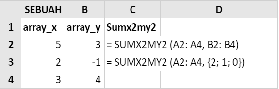
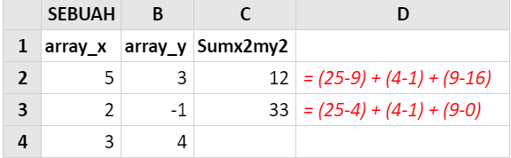

# SUMX2MY2

### Syntax



```text
SUMX2MY2 ( array_x , array_y )
```



### Parameter

| Parameter | Deskripsi |
| :--- | :--- |
| array \_x | Array atau rentang nilai pertama. |
| array\_y | Array atau rentang nilai kedua. |




### Keterangan

* Argumen harus berupa angka atau nama, array, atau referensi yang berisi angka-angka.
* Jika sebuah argumen array atau referensi mencakup teks, nilai logika, atau sel kosong, maka nilai-nilai itu diabaikan; akan tetapi sel-sel dengan nilai nol dimasukkan.
* Jika array\_x dan array\_y memiliki jumlah nilai yang berbeda, SUMX2MY2 mengembalikan nilai kesalahan \#N/A.
* Persamaan untuk jumlah selisih kuadrat adalah:

  


### Contoh Implementasi





