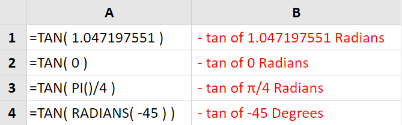
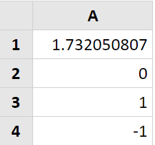

# TAN

## Syntax



```text
TAN ( Number )
```



## Parameter

| Parameter | Deskripsi |
| :--- | :--- |
| Number | Sudut dalam radian yang ingin Anda dapatkan tangennya. |



> ### Jika sudut Anda dalam derajat, Anda harus mengubahnya menjadi radian sebelum memasoknya ke fungsi Tan.
>
> ### Ini bisa dilakukan dengan menggunakan fungsi
>
> ### [Excel Radians](https://translate.googleusercontent.com/translate_c?depth=1&hl=id&prev=search&rurl=translate.google.co.id&sl=en&sp=nmt4&u=https://www.excelfunctions.net/excel-radians-function.html&xid=25657,15700022,15700043,15700186,15700190,15700248,15700253&usg=ALkJrhiGGG1bX_HdFDMS0UN6Ep76VZMujA)  : **= RADIANS\(derajat\)**

## **Contoh Implementasi**





