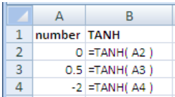
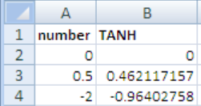

# TANH

### Syntax



```text
TANH ( Number )
```



### Parameter

| Parameter | Deskripsi |
| :--- | :--- |
| Number | bilangan real yang akan  dihitung garis singgung hiperboliknya. |


### Keterangan

Rumus untuk tangen hiperbolik adalah:




### Contoh Implementasi





