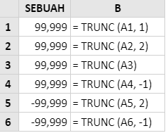
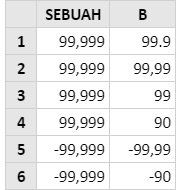

# TRUNCH

## Syntax



```text
TRUNC( number, [num_digits] )
```



## Parameter

| Parameter | Deskripsi |
| :--- | :--- |


| Number | Nomor yang akan dipotong |
| :--- | :--- |


<table>
  <thead>
    <tr>
      <th style="text-align:left">[num_digit]</th>
      <th style="text-align:left">
        <p>Argumen opsional yang menentukan jumlah tempat desimal untuk memotong
          angka yang disediakan.</p>
        <p>Jika dihilangkan, argumen [num_digits] menggunakan nilai default 0.</p>
        <p>Perhatikan bahwa:</p>
        <ul>
          <li>Nilai [num_digits] positif menentukan jumlah digit di sebelah kanan titik
            desimal;</li>
          <li>Jika [num_digits] adalah 0 (atau dihilangkan), nomor yang diberikan terpotong
            ke bilangan bulat terdekat;</li>
          <li>Nilai [num_digits] negatif menentukan jumlah digit di sebelah kiri titik
            desimal.</li>
        </ul>
      </th>
    </tr>
  </thead>
  <tbody></tbody>
</table>



