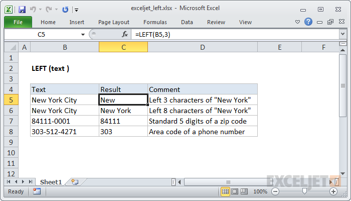

# EXCEL LEFT FUNCTION



#### Syntax

```text
=LEFT (text, [num_chars])
```

#### Parameter 

| **Parameter** | **Penjelasan** |
| :--- | :--- |
| text | Teks yang digunakan untuk mengekstrak karakter |
| num\_chars | \[opsional\] Jumlah karakter untuk diekstraksi, mulai dari sisi kiri teks. Default = 1. |

#### Note


* Gunakan fungsi LEFT ketika Anda ingin mengekstraksi karakter mulai dari sisi kiri teks.
* num\_chars adalah opsional dan defaultnya adalah 1



