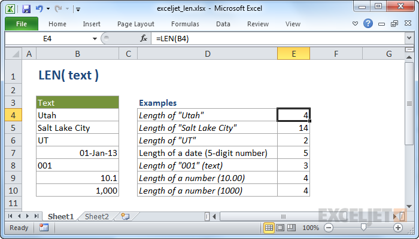

# Excel LEN Function




#### Syntax

```text
=LEN (text)
```

#### Parameter 

| **Parameter** | **Penjelasan** |
| :--- | :--- |
| text | Teks yang akan digunakan untuk menghitung panjang |

#### Note


* LEN berguna ketika Anda ingin menghitung berapa banyak karakter dalam beberapa teks.
* Pemformatan angka tidak termasuk. \(mis. panjang "100" yang diformat sebagai "$ 100,00" masih 3\).


