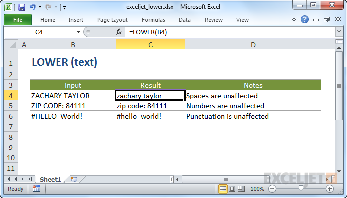

# Excel LOWER Function




#### Syntax

```text
=LOWER (text)
```

#### Parameter 

| **Parameter** | **Penjelasan** |
| :--- | :--- |
| text | Teks yang harus dikonversi menjadi huruf kecil |

#### Note


* Semua huruf dalam teks dikonversi ke huruf kecil
* Angka dan tanda baca tidak terpengaruh


