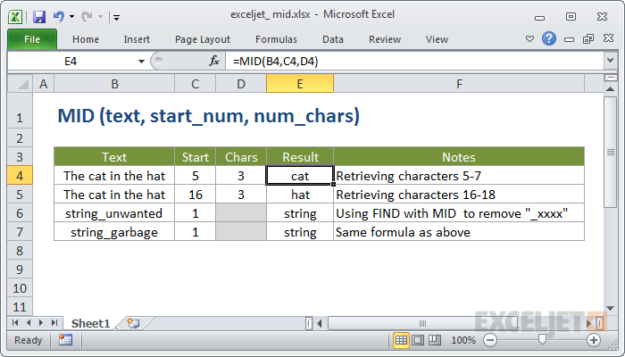

# Excel MID Function




#### Syntax

```text
=MID (text, start_num, num_chars)
```

#### Parameter 

| **Parameter** | **Penjelasan** |
| :--- | :--- |
| text | Teks untuk diekstrak |
| start\_num | Lokasi karakter pertama yang diekstrak |
| num\_chars | Jumlah karakter untuk diekstraksi |

#### Note


* Gunakan fungsi MID saat Anda ingin mengekstraksi teks dari dalam string teks, berdasarkan lokasi dan panjangnya.
* Anda dapat menggunakan FIND atau SEARCH untuk menemukan start\_num ketika Anda tidak tahu lokasi sebelumnya.


