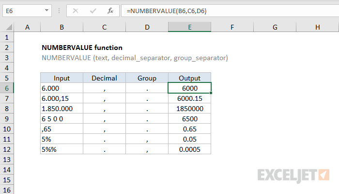

# Excel NUMBERVALUE Function




#### Syntax

```text
=NUMBERVALUE (text, [decimal_separator], [group_separator])
```

#### Parameter 

| **Parameter** | **Penjelasan** |
| :--- | :--- |
| text | Teks untuk dikonversi ke angka |
|  decimal\_separator | \[opsional\] Karakter untuk nilai desimal |
| group\_separator | \[opsional\] Karakter untuk dikelompokkan oleh ribuan |

#### Note


* Fungsi NUMBERVALUE mengubah nilai teks yang mewakili angka menjadi angka yang valid menggunakan pemisah desimal khusus dan pemisah grup.



