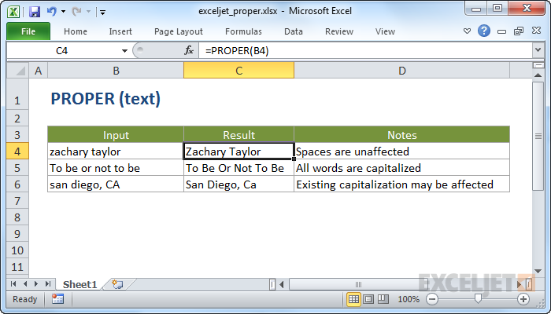

# Excel PROPER Function




#### Syntax

```text
=PROPER (text)
```

#### Parameter 

| **Parameter** | **Penjelasan** |
| :--- | :--- |
| text | Teks yang harus dikonversi |

#### Note


* Gunakan PROPER untuk mengkapitalisasikan huruf awal setiap kata dalam string yang diberikan.


