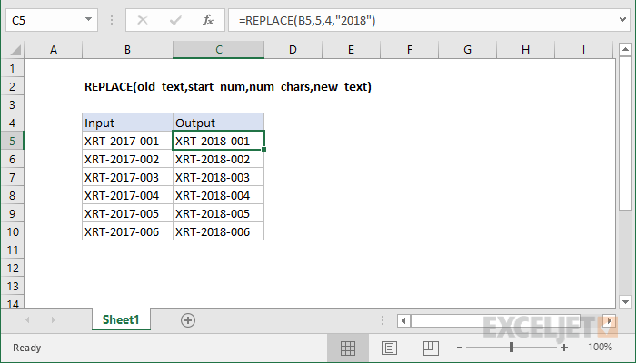

# Excel REPLACE Function




#### Syntax

```text
=REPLACE (old_text, start_num, num_chars, new_text)
```

#### Parameter 

| **Parameter** | **Penjelasan** |
| :--- | :--- |
|  old\_text | Teks yang akan diganti |
| start\_num | Lokasi awal dalam teks untuk diganti |
| num\_chars | jumlah karakter yang akan diganti |
| new\_text | Teks yang baru |

#### Note


* Gunakan fungsi REPLACE ketika Anda ingin mengganti teks berdasarkan lokasinya dalam string


