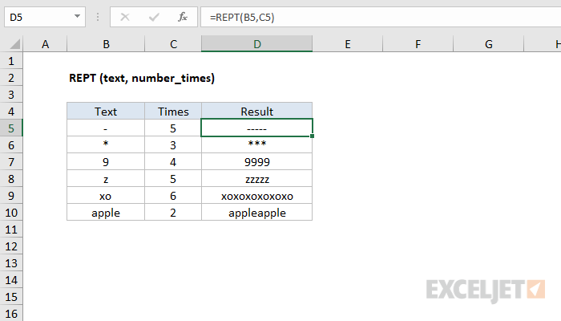

# REPT

Fungsi Excel REPT mengulangi karakter sesuai yang diinginkan oleh user.



#### Syntax

```text
=REPT(text;number_times)
```

| **Parameter** | **Penjelasan** |
| :--- | :--- |
| text | Teks yang akan diulang. |
| number\_times | Frekuensi mengulangi teks. |


* Gunakan fungsi REPT untuk mengulangi teks beberapa kali. Ini bisa berguna jika Anda ingin mengisi sel, atau nilai dengan panjang tertentu.


