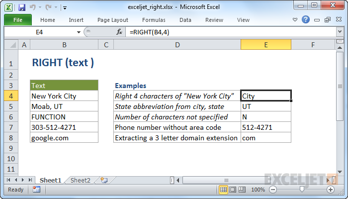

# Excel RIGHT Function




#### Syntax

```text
=RIGHT (text, [num_chars])
```

#### Parameter 

| **Parameter** | **Penjelasan** |
| :--- | :--- |
|  text | Teks yang digunakan untuk mengekstrak karakter |
| num\_chars | \[opsional\] Jumlah karakter untuk diekstraksi, mulai dari sisi kanan teks. Default = 1. |

#### Note


* Gunakan fungsi RIGHT ketika Anda ingin mengekstraksi karakter mulai dari sisi kanan teks.



